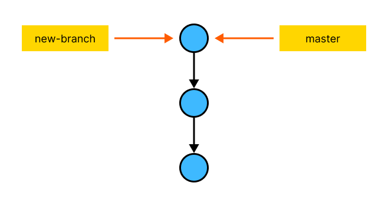

# Ветки

> Для этого урока можно использовать репозиторий из предыдущих уроков, либо создать новый.

Как мы говорили ранее, каждый коммит - это фиксация определенного состояния репозитория (папки), т. е. структуры файлов и папок, их содержимого и прав доступа. Каждый коммит имеет уникальный идентификатор - хеш, который мы может использовать в командах, чтобы указать на этот коммит.

Посмотрите лог (`git log --oneline`) репозитория.

```
4e7fc64 (HEAD -> master) Изменил основной цвет
751eaa6 Изменил заголовок страницы
087b541 Первый коммит
```

Созданные нами коммиты можно рассмотреть в виде такой цепочки:


Каждый коммит указывает на предыдущий, за исключением первого. Мы находимся на самом верху этой цепочки, т. е. на последнем коммите.

Мы говорили, что Git позволяет возвращаться к предыщим версиям проекта и обратно, к актуальной версии, что мы и научимся делать в этом уроке: будем переключаться между коммитами, но прежде нужно разобраться, что означают слова `HEAD` и (или `master`).

`master` - это т. н. ветка.

**Ветка** - это указатель с произвольным названием, который содержит хеш (идентификатор) определенного коммита. Технически, это просто файл в служебной папке `.git` (о ней мы говорили в уроке про создание репозитория), который хранит хеш коммита, на который указывает эта ветка,

По-умолчанию, при создании коммита создается ветка `master` (или `main` в более новых версиях Git). Т. к. в пустом репозитории нет коммитов, она никуда не указывает. При создании первого коммита, она начинает указывать на этот коммит. При создании последующих коммитов, она переключается на последний созданный коммит.


Ветки позволяют работать над несколькими версиями проекта одновременно, что может быть полезно для параллельной работы

## Создание новой ветки

Попробуем разобраться на примере. Для этого создадим новую ветку под названием `new-brach`:

```bash
git branch new-branch
```

Название ветки может быть произвольным. Лучше не мудрить и называть их, используя буквы латинского алфавита, цифры, а также дефис или нижнее подчеркивание для разделения слов.

Посмотрим список веток:

```bash
git branch
* master
  new-branch
```

И лог:

```bash
4e7fc64 (HEAD -> master, new-branch) Изменил основной цвет
751eaa6 Изменил заголовок страницы
087b541 Первый коммит
```

Создалась новая ветка `new-branch`, которая указывает на тот же коммит, что и `master`. Т. к. мы создали эту ветку, находясь на ветке `master`, говорится, что она “*была создана от ветки* `master`".



Посмотрите статус:

```bash
На ветке master
нечего коммитить, нет изменений в рабочем каталоге
```

Мы все еще находимся на ветке `master`.

Как Git понимает, на какой ветке мы находимся? Для этого и существует указатель `HEAD`, который хранит название текущей ветки. По логу (строка `HEAD -> master`) видно, что он сейчас указывает на `master`.


Что нам дает наличие двух веток? Если раньше, создавая коммиты, у нас была последовательная цепочка коммитов, то теперь при создании коммитов у нас будут две независимые цепочки, которые имеют общее основание (в данном случае, коммит `4e7fc64`).

## Переключение между ветками

Попробуем переключить на ветку `new-branch`. Это делается с помощью команды `git checkout`:

```bash
git checkout new-branch
```

Переключившись на другую ветку мы переключили указатель `HEAD` на эту ветку.


Файлы никак не изменились, т. к. обе ветки указывают на один и тот же коммит. Переключить обратно можно с помощью этой же команды, изменив название ветки на `master`, либо указав вместо названия минус:

```bash
git checkout -
```

Эта команда переключается на предыдущую ветку. Если выполнить ее еще раз, вы переключитесь обратно на `new-branch`.

## Создание коммитов в разных ветках

Переключитесь на ветку `master`, если вы сейчас не находитесь на ней. Измените что-нибудь и сделайте коммит. В моем случае я переименовал класс поля ввода c `new-task-text` на `task-description-input` и создал коммит с сообщением `Переименовал поле ввода`. Как цепочка коммитов выглядит теперь?


Ветка `new-branch` указывает на тот же коммит, что и прежде, а вот `master` указывает на новый коммит. Просмотрите лог.

### Создание коммит в новой ветке, раздвоение цепочки коммитов

Теперь переключитесь на ветку `new-branch`. Обратите внимание, что файлы вернулись к тому состоянию, которое было до создания коммита в ветке `master`, что должно быть очевидно, т. к. `new-branch` смотрит на предыдущий коммит.


Просмотрите лог. Обратите внимание, что он тоже отличается - последним коммитом он показывает тот, куда указывает ветка `new-branch` (в моем случае это `4e7fc64` - `Изменил основной цвет`).

Измените что-нибудь и создайте коммит. Я добавил мета-тег `viewport` в файл `index.html` и создал коммит с сообщением `Добавил мета-тег viewport`.

Теперь дерево коммитов выглядит вот так:


Теперь у нас есть две независимые цепочки коммитов.

## Закрепление создания веток

Для закрепления создания веток, создадим еще одну ветку от ветки `new-branch`. Если вы не находитесь на ней (определить это можно с помощью команды `git brach` или `git status`), то переключитесь на нее:

```bash
git checkout new-branch
```

Теперь создайте новую ветку. Назовем ее `another-branch`:

```bash
git branch another-branch
```

Это ветка указывает на тот же коммит, что и `new-branch`, т. к. была создана от нее. Мы все еще находимся на ветке `new-branch`, чтобы переключиться на новую ветку, выполните `git checkout`:

```bash
git checkout another-branch
```

Теперь при создании коммитов в этих ветках, это также будут независимые цепочки. Такое ветвление практически не ограничено.

Создадим еще одну ветку, но на этот раз от ветки `master` (от одной ветки можно создавать сколько угодно других веток). Переключимся на `master`:

```bash
git checkout master
```

Назовем новую ветку `yet-another-branch`. Можно как и раньше воспользоваться командами `git branch` и `git checkout` для создания ветки и переключения на нее, но в Git есть удобное сокращение для этого, которое объединяет эти две команды:

```bash
git checkout -b yet-another-branch
```

Эта команда создаст ветку `yet-another-branch` и сразу переключится на нее. Если ветка с таким названием уже существует, вы получите ошибку.

Просмотрите список веток с помощью команды `git branch`. 