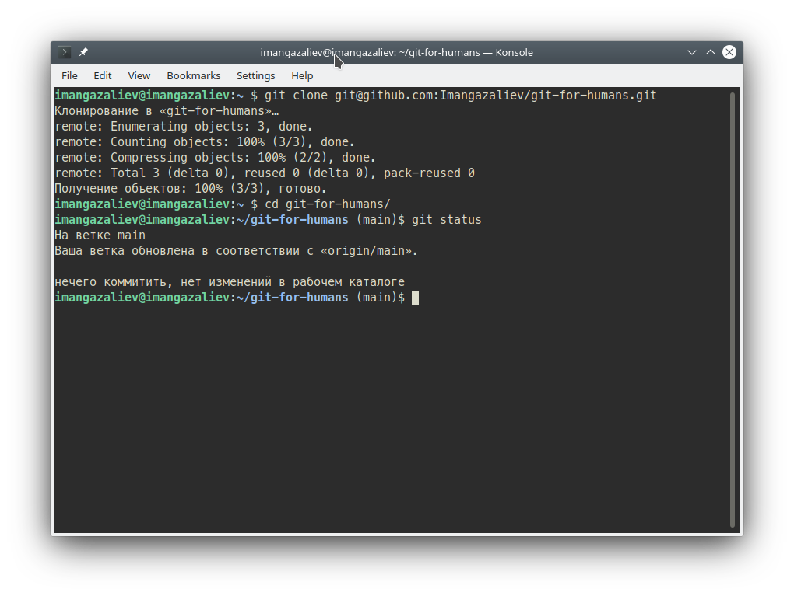

# Введение

Git - консольная программа, поэтому перед прохождением этого туториала необходимо освоить работу с терминалом хотя бы на базовом уровне.

Для Git также есть и [графические интерфейсы](https://git-scm.com/downloads/guis), на в данном туториале они не будут рассмотрены.

Если вы только начинаете осваивать Git, постарайтесь выполнять практические упражнения, которые приводят в уроках. Местами пояснение может показаться излишне детальным и повторяющимся, это сделано намерено.

**[Что такое система контроля версий? →](what-is-vcs.md)**
