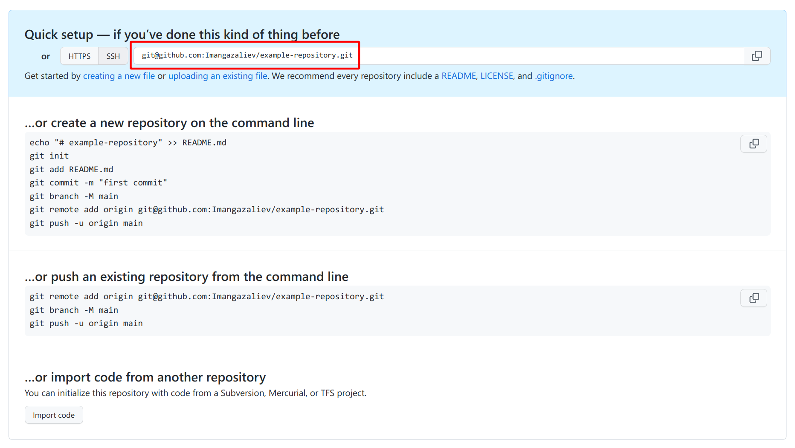

# Удаленные репозитории (GitHub / GitLab / BitBucket)

Вся работа в предыдущих уроках происходила локально, т. е. на вашем компьютере. Для взаимодействия с другими разработчиками небходимо промежуточное хранилище, которое называется удаленный репозиторий (т. е. находящийся на удалении, не локальный).

Существует множество сервисов, которые предоставляет возможность хостинга (хранения и доступа) удаленных репозиториев, самое популярные из которых это [GitHub](https://github.com), [GitLab](https://gitlab.com) и [BitBucket](https://bitbucket.org). В данном туториале мы будем использовать GitHub. Зайдите на [github.com](http://github.com) и зарегистрируйтесь там.

## Создание удаленного репозитория

Работа с удаленными репозиториями происходит через консоль, но для начала необходимо создать удаленный репозиторий на сайте сервиса. Для этого нажмите на плюсик в правом верхнем углу и выберите пункт “New repository”:


Откроется страница создания репозитория:


Укажите название репозитория, описание и доступность репозитория для других пользователей: **public** (видно всем) или **private** (видно только вам). Название может состоять из латинских символов, дефиса и нижнего подчеркивания. Я создал приватный репозиторий с параметрами выше, после чего меня перенаправило на страницу репозитория: <https://github.com/Imangazaliev/example-repository>.

## Настройка доступа

Для работы с удаленными репозиториями Git использует механизм протокол SSH. Что это такое знать необязательно, но для доступа к удаленному репозиторию нужно произвести небольшую настройку.

Для работы с удаленным сервером и доступа к репозиториям в вашем аккаунте необходим SSH-ключ, который служит чем-то наподобие пароля.

SSH-ключ представляет собой пару из приватного и публичного ключей. Нужно сгенерировать SSH-ключ и указать его в настройках пользователя. В случае с GitHub это делается по адресу <https://github.com/settings/keys>. Этот раздел обычно называет что-то вроде “SSH and GPG keys” и находится в настройках пользователя.

Чтобы сгенерировать SSH-ключ (пару ключей), выполните в терминале команду `ssh-keygen`. Команда спросит, куда сохранит ключ и попросит указать пароль, вам нужно просто нажимать Enter. Пароль указывать не стоит, иначе вам придется вводить его при каждом взаимодействии с удаленным репозиторием.

Команда сгенерировала пару ключей и сохранили их в два файла в папке `.ssh`, которая находится в папке пользователя (она же домашняя директория). Чтобы просмотреть его, выполните команду:

```bash
cat ~/.ssh/id_rsa.pub
```

Публичный ключ выглядит как-то так:

```bash
ssh-rsa AAAAB3NzaC1yc2EAAAADAQABAAABAQDMEH+WuBcnvOuWaVF51/eTHs/zc2/86UAqrltXw84l/Y/vYio4RsKVXi+fpYKuyBc8+nlszonWixB1dh9yQJ3w9f+8QtbLYLE0vmfwUqnqsbsH+23DMbxOhgn9DvK00L9nlAvmHi7kR1usKpQAqx/4mBVv2hlmcryhy0+AAkWsmQd2alnr3bDACSlrdC3EQSg6tNzfU17FGPv+W40/b9D4QyIszX00Ame/EvodAwb9ZLfRDx8pL1HaOcqOn8fM4EwLuP1eUTRwdh4gTBc+sRthUPTNvx0HXBaMYUv6bwz0ZRtbKIkixqnxU93F2XgbU5xz593pA0lksbcPdtYgYpWL imangazaliev@imangazaliev
```

Добавьте ваш ключ по на странице с ключами на GitHub.

## Добавление удаленного репозитория в локальный репозиторий

Теперь нужно указать URL удаленного репозитория в настройках нашего локального репозитория. Скопируйте URL на странице созданного репозитория:



И выполните команду:

```bash
git remote add origin git@github.com:Imangazaliev/example-repository.git
```

Не забудьте заменить URL удаленного репозитория на ваш. Мы добавили удаленный репозиторий, указав ему название `origin`. Теперь ваш локальный репозиторий связан с удаленным и можно начать работу с ним.

**Внимание:** слово “связан с удаленным репозиторием” не означает, что изменения в обоих этих репозиториях автоматически синхрозируются, все это делается вручную. Помните, что любая команда Git меняет что-то одно - либо локальный репозиторий, либо удаленный.

## Отправка изменений на удаленный репозиторий

Попробуем отправить коммиты ветки `master` на удаленный репозиторий. Переключитесь на нее , если вы сейчас не на ней и выполните команду `git push`. Вы получите следующий результат:

```
fatal: Текущая ветка master не имеет вышестоящей ветки.
Чтобы отправить текущую ветку и установить внешнюю ветку как вышестоящую для этой ветки, используйте

    git push --set-upstream origin master
```

Эту ошибку Git выдал потому что ваша локальная ветка не привязана к ветке в удаленном репозитории, т. е. там нет метки с названием `master`. Git подсказывает, которую нужно выполнить, чтобы связать локальную и удаленную ветку, выполните ее:

```bash
git push --set-upstream origin master
Перечисление объектов: 11, готово.
Подсчет объектов: 100% (11/11), готово.
При сжатии изменений используется до 8 потоков
Сжатие объектов: 100% (11/11), готово.
Запись объектов: 100% (11/11), 2.10 КиБ | 2.10 МиБ/с, готово.
Всего 11 (изменения 3), повторно использовано 0 (изменения 0)
remote: Resolving deltas: 100% (3/3), done.
To github.com:Imangazaliev/todo-list-example.git
 * [new branch]      master -> master
Ветка «master» отслеживает внешнюю ветку «master» из «origin».
```

Откройте страницу вашего репозитория и вы увидите ваши файлы. Нажмите на количество коммитов в правом верхнем углу, чтобы просмотреть историю коммитов:


**[← Ветки](branches.md)**
