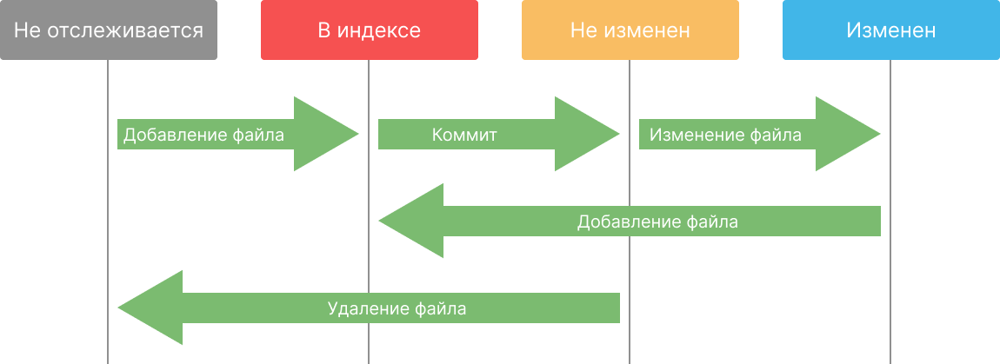

 

# Отслеживаемые и неотслеживаемые файлы

Все файлы в репозитории делятся на **отслеживаемые** (**tracked**) и **неотслеживаемые** (**untracked**).

Отслеживаемые файлы - это файлы о которых знает Git. Файл становится отслеживаемым с момента добавления в индекс.



Как видно на изображении, после первого коммита, файл проходит один и тот же цикл: изменение → индекс → коммит.

Разберем эту концепцию на примерах. Для каждого примера нужно создавать новый репозиторий.

### Пример #1

Добавим в репозиторий новый файл `README.md` (файл в формате Markdown) и выполним `git status`:

```
На ветке master
Неотслеживаемые файлы:
  (используйте «git add <файл>…», чтобы добавить в то, что будет включено в коммит)
        README.md

ничего не добавлено в коммит, но есть неотслеживаемые файлы (используйте «git add», чтобы отслеживать их)
```

Содержимое файла:

```markdown
# To-Do List
```

Файл `README.md` новый, мы не создавали коммитов с ним и он сейчас не в индексе, поэтому Git показывает его в списке “Неотслеживаемые файлы”. Добавим файл в индекс с помощью команды `git add` и снова посмотрим статус:

```
На ветке master
Изменения, которые будут включены в коммит:
  (используйте «git restore --staged <файл>…», чтобы убрать из индекса)
        новый файл:    README.md
```

Файл стал отслеживаемым. Изменим содержимое файла на следующее:

```markdown
# To-Do List

Простое приложение для ведения списка дел.
```

И снова посмотрим `status`:

```
На ветке master
Изменения, которые будут включены в коммит:
  (используйте «git restore --staged <файл>…», чтобы убрать из индекса)
        новый файл:    README.md

Изменения, которые не в индексе для коммита:
  (используйте «git add <файл>…», чтобы добавить файл в индекс)
  (используйте «git restore <файл>…», чтобы отменить изменения в рабочем каталоге)
        изменено:      README.md
```

И дифф (`git diff`):

```
diff --git a/README.md b/README.md
index 608e51b..314337e 100644
--- a/README.md
+++ b/README.md
@@ -1,2 +1,4 @@
 # To-Do List
 
+Простое приложение для ведения списка дел.
+
```

Как Git сравнивает файлы, если мы еще не коммитили его? При выполнении `git add`, Git не просто добавляет файл в список файлов для коммита, а копирует его содержимое, поэтому когда мы изменяем файл, мы имеем возможность сравнить две версии файла: ту, что была на момент добавления в индекс и ту, что сейчас есть в репозитории.

Если мы удалим файл, Git также заметит это:

```
На ветке master
Изменения, которые будут включены в коммит:
  (используйте «git restore --staged <файл>…», чтобы убрать из индекса)
        новый файл:    README.md

Изменения, которые не в индексе для коммита:
  (используйте «git add/rm <файл>…», чтобы добавить или удалить файл из индекса)
  (используйте «git restore <файл>…», чтобы отменить изменения в рабочем каталоге)
        удалено:       README.md
```

Файлы в индексе отмечаются зеленым, а измененные и неотслеживаемые - красным.

Посмотрим дифф:

```
diff --git a/README.md b/README.md
deleted file mode 100644
index f48e33d..0000000
--- a/README.md
+++ /dev/null
@@ -1 +0,0 @@
-# To-Do List
```

Теперь выполним `git add` и посмотрим статус:

```
На ветке master
нечего коммитить, нет изменений в рабочем каталоге
```

Индекс обновился и т. к. файл был удален, он был удален и из индекса.

### Пример #2

1. Как и в первом примере создайте файл `README.md` и посмотрите статус. Файл снова будет в списке неотслеживаемых.
2. Попробуйте посмотреть дифф. Git ничего не покажет, т. к. файл не отслеживается (т. е. его нет в коммитах или в индексе) и сравнивать текущее содержимое не с чем.
3. Теперь удалите файл и снова посмотрим статус. Вы увидите:

```
На ветке master
нечего коммитить, нет изменений в рабочем каталоге
```

Т. к. файл не отслеживался, Git даже “не заметил” то, что мы добавили и удалили файл.

### Пример #3

1. Создайте файл `README.md` и создайте коммит.

```markdown
# To-Do List

Простое приложение для ведения списка дел.
```

1. Проверьте статус репозитория.

```
На ветке master
нечего коммитить, нет изменений в рабочем каталоге
```

1. Удалите файл, проверьте статус и дифф.

```
На ветке master
Изменения, которые не в индексе для коммита:
  (используйте «git add/rm <файл>…», чтобы добавить или удалить файл из индекса)
  (используйте «git restore <файл>…», чтобы отменить изменения в рабочем каталоге)
        удалено:       README.md

нет изменений добавленных для коммита
(используйте «git add» и/или «git commit -a»)
diff --git a/README.md b/README.md
deleted file mode 100644
index e6c0014..0000000
--- a/README.md
+++ /dev/null
@@ -1,3 +0,0 @@
-# To-Do List
-
-Простое приложение для ведения списка дел.
```

1. Добавьте файл в индекс (с помощью `git add README.md` или `git add .`). Несмотря на то, что файл удален, мы добавляем в индекс не сам файл, а информацию о том, что он удален. Снова посмотрите дифф, там будет пусто, т. к. сейчас нет разницы между текущим состоянием файлов и тем, что в индексе (это мы разбирали ранее).
2. Создайте тот же самый файл заново, посмотрите статус и дифф.

```
На ветке master
Изменения, которые будут включены в коммит:
  (используйте «git restore --staged <файл>…», чтобы убрать из индекса)
        удалено:       README.md

Неотслеживаемые файлы:
  (используйте «git add <файл>…», чтобы добавить в то, что будет включено в коммит)
        README.md
```

Файл отображается как неотслеживаемый, хотя он есть в коммите. Это, как мы говорили ранее, происходит потому, что текущее состояние (файл существует) сравнивается сначала с индексом (где он отмечен как удаленный) и если там ничего нет, то с коммитом.

1. Выполните `git add` и снова проверьте статус. Изменений нет, т. к. после добавления в индекс, изменения в нем и в последнем коммите были равны и взаимоисключили друг друга, значит коммитить нечего.

**[← Коммиты, продолжение](commits-second-part.md)** | **[Переименование файлов →](renaming-files.md)**
