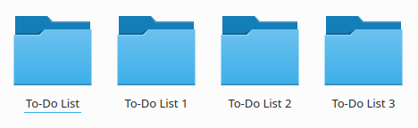
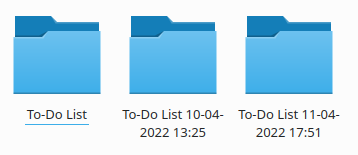

# Что такое система контроля версий

Представим, что мы работаем над проектом `To-Do List` (список дел).

[**Скачать пример проекта**](https://github.com/Imangazaliev/todo-list-example/archive/refs/tags/1.0.zip)

В процессе работы над проектом может возникнуть возникнуть ситуация, когда вы “сломали” проект, т. е. сделали его неработоспособным и теперь вам нужно как-то отменить ваши изменения. Если вы не закрывали редактор, вы можете воспользоваться Ctrl + Z, но что, если вы закрыли редактор, выключали и включали компьютер и т. д.? Отменить изменения уже не получится.

Получается, нам нужно как-нибудь хранить историю изменений проекта.

Первое, что приходит в голову - периодически создавать копию папки проекта, добавляя порядковый номер копии. Например, наш проект называется . В папке с этим названием хранится актуальная версия проекта. Периодически мы создаем копию этой папки: `To-Do List 1`, `To-Do List 2`, `To-Do List 3`. Номера `1, 2, 3, ..., N` - это версии проекта. Теперь при необходимости мы можем посмотреть, что было в старых версиях проекта и вернуться к старой версии, заменив актуальную папку нужной версией. 



Следующая идея, которая может прийти - добавлять не порядковый номер, а время создания копии, что позволит нам уже по названию папки понять, когда были сделаны изменения. Пример: 

- `To-Do List 10-04-2022 13:25`
- `To-Do List 11-04-2022 17:51`



В процессе работы стало понятно, что нужно еще понимать, какие изменения были сделаны в конкретной версии. Создадим простой текстовый файл `changelog.txt` (`changelog` - история изменений) и будем записывать, какие изменения были сделаны:

```
10-04-2022 13:25 - Исправил баги
11-04-2022 17:51 - Добавил возможность поиска
```

Каждая такая копия **фиксирует определенное состояние проекта** (обратите на это внимание, в будущем нам это понадобится).

Представим также, что над проектом работает не один разработчик, а несколько (пока что за одним компьютером, как бы странно это не звучало, но все же) и мы хотим знал, кто именно сделал эти изменения. Будем записывать имя автора рядом с записью в истории изменений:

```
10-04-2022 13:25 - Исправил баги (Muhammad Imangazaliev)
11-04-2022 17:51 - Добавил возможность поиска (Makhach Imangazaliev)
```

Итак, мы построили систему хранения версий проекта, которая позволяет:

- Откатиться к нужной версии
- Узнать, когда и кем были сделаны изменения
- Понять, какие изменения были сделаны

Какие проблемы при этом есть:

- Мы должны помнить о необходимость периодического создания новых версий. Если делать это редко - последняя сохраненная версия будет слишком старой и в случае необходимости откатиться мы потеряем множество изменений.
- Копии проекта занимают место и если проект большой, в скором времени свободного пространства на диске может не остаться. Нужно также не забывать удалять старые версии, чтобы избежать этого.
- У нас нет возможности понять, какие именно файлы в каждой конкретной версии были изменены и что именно было в них изменено.
- Нет возможности работать над проектом нескольким людям, которые находятся на удалении друг от друга.

Чтобы автоматизировать всю работу были разработаны специальная программы - **системы управления версиями** или **системы контроля версий**.

Итак, **система контроля версий** (англ. version control system, VCS) - это система, обеспечивающая сохранение истории изменений файлов проекта.


**[← Введение](intro.md)** | **[Установка Git →](install-git.md)**
